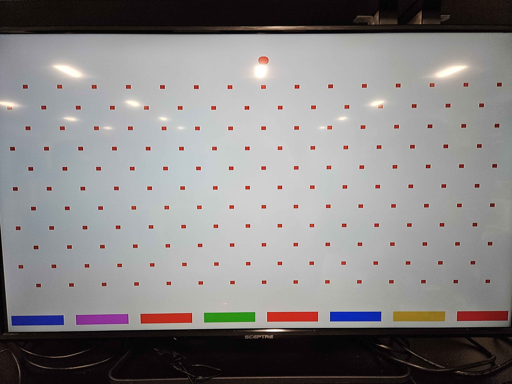

# FPGA VGA Plinko Game (Nexys Board)

## Project Overview
This project implements a **VGA-based Plinko-style arcade game** on the **Digilent Nexys A7 FPGA board** using **VHDL** and **Vivado**. The game features gravity-driven ball motion through a fixed field of pegs and multiple scoring zones at the bottom of the screen. The system generates real-time VGA video, processes user input via onboard pushbuttons, and displays a running score on the onboard 7-segment display.

Here's the game we are basing our project on:


The design follows the modular structure used in the course labs, with separate components for:
- VGA timing and pixel scanning
- Game logic (ball physics, peg collisions, scoring)
- Clock generation
- Seven-segment display control
## Required Hardware
- **Digilent Nexys FPGA board**


- **VGA monitor** (800×600 @ 60 Hz)


- **VGA cable**


- **USB cable** (programming and power)


--- 
## Diagrams
### Module Hierarchy Diagram

--- 

## Scoring System
* Red: 0 points
* Blue: 1 point 
* Green: 2 points 
* Pink: 3 points 
* Gold: 5 points 
--- 
## Gameplay
### Game GIF


### Game GIF


### JPG


---

## Inputs and Outputs
### Inputs
| Signal | Board Resource | Description |
|------|---------------|-------------|
| `clk_in` | 100 MHz clock | System clock |
| `btn0` | Pushbutton | Serve / start | 
| `btnl` | Pushbutton | Move bat left |
| `btnr` | Pushbutton | Move bat right |

### Outputs
| Signal | Board Resource | Description |
|-------|---------------|-------------|
| `VGA_red[3:0]` | VGA DAC | Red channel |
| `VGA_green[3:0]` | VGA DAC | Green channel |
| `VGA_blue[3:0]` | VGA DAC | Blue channel |
| `VGA_hsync` | VGA | Horizontal sync |
| `VGA_vsync` | VGA | Vertical sync |
| `SEG7_anode[7:0]` | 7-seg | Digit select |
| `Counter` | Anode | Score of player |
| `Attempts` | Anode | Attempts of player |

### Bat and Ball VHDL File
```vhdl
LIBRARY IEEE;
USE IEEE.STD_LOGIC_1164.ALL;
USE IEEE.STD_LOGIC_ARITH.ALL;
USE IEEE.STD_LOGIC_UNSIGNED.ALL;

ENTITY bat_n_ball IS
    PORT (
        v_sync : IN STD_LOGIC;
        pixel_row : IN STD_LOGIC_VECTOR(10 DOWNTO 0);
        pixel_col : IN STD_LOGIC_VECTOR(10 DOWNTO 0);
        serve : IN STD_LOGIC; -- initiates serve
        red : OUT STD_LOGIC;
        green : OUT STD_LOGIC;
        blue : OUT STD_LOGIC;
        counter : OUT STD_LOGIC_VECTOR(6 DOWNTO 0);
        attempts : OUT STD_LOGIC_VECTOR(3 DOWNTO 0);
        ball_x : IN STD_LOGIC_VECTOR (10 DOWNTO 0) -- current ball x position
    );
END bat_n_ball;

ARCHITECTURE Behavioral OF bat_n_ball IS
    CONSTANT bsize : INTEGER := 8; -- ball size in pixels
    SIGNAL bat_w : INTEGER := 200; -- bat width in pixels
    CONSTANT bat_h : INTEGER := 10; -- bat height in pixels
    CONSTANT peg_row_gap : INTEGER := 40;
    CONSTANT peg_col_gap : INTEGER := 50;
    CONSTANT max_rows : INTEGER := 10; --Rows
    CONSTANT max_columns : INTEGER := 14; --Columns
    -- distance ball moves for each frame
    SIGNAL ball_speed : STD_LOGIC_VECTOR (10 DOWNTO 0) := CONV_STD_LOGIC_VECTOR (3, 11);
    SIGNAL ball_on : STD_LOGIC; 
    SIGNAL ball_on1 : STD_LOGIC := '0'; 
    SIGNAL bat_on1 : STD_LOGIC; 
    SIGNAL bat_on2 : STD_LOGIC; 
    SIGNAL bat_on3 : STD_LOGIC; 
    SIGNAL bat_on4 : STD_LOGIC; 
    SIGNAL bat_on5 : STD_LOGIC; 
    SIGNAL bat_on6 : STD_LOGIC; 
    SIGNAL bat_on7 : STD_LOGIC; 
    SIGNAL bat_on8 : STD_LOGIC; 

    SIGNAL game_on : STD_LOGIC := '0'; -- indicates whether ball is in play
    --ball on top logic
    SIGNAL ball_x_1: STD_LOGIC_VECTOR(10 DOWNTO 0);
    SIGNAL ball_y: STD_LOGIC_VECTOR(10 DOWNTO 0) := CONV_STD_LOGIC_VECTOR(50, 11);
    --peg logic
    SIGNAL ball_x1: STD_LOGIC_VECTOR(10 DOWNTO 0) := CONV_STD_LOGIC_VECTOR(100, 11);
    SIGNAL ball_y1: STD_LOGIC_VECTOR(10 DOWNTO 0) := CONV_STD_LOGIC_VECTOR(100, 11);
    
    -- bat vertical position
    CONSTANT bat_x1 : STD_LOGIC_VECTOR(10 DOWNTO 0) := CONV_STD_LOGIC_VECTOR(45, 11);
    CONSTANT bat_y1 : STD_LOGIC_VECTOR(10 DOWNTO 0) := CONV_STD_LOGIC_VECTOR(575, 11);
    CONSTANT bat_x2 : STD_LOGIC_VECTOR(10 DOWNTO 0) := CONV_STD_LOGIC_VECTOR(145, 11);
    CONSTANT bat_y2 : STD_LOGIC_VECTOR(10 DOWNTO 0) := CONV_STD_LOGIC_VECTOR(575, 11);
    CONSTANT bat_x3 : STD_LOGIC_VECTOR(10 DOWNTO 0) := CONV_STD_LOGIC_VECTOR(245, 11);
    CONSTANT bat_y3 : STD_LOGIC_VECTOR(10 DOWNTO 0) := CONV_STD_LOGIC_VECTOR(575, 11);
    CONSTANT bat_x4 : STD_LOGIC_VECTOR(10 DOWNTO 0) := CONV_STD_LOGIC_VECTOR(345, 11);
    CONSTANT bat_y4 : STD_LOGIC_VECTOR(10 DOWNTO 0) := CONV_STD_LOGIC_VECTOR(575, 11);
    CONSTANT bat_x5 : STD_LOGIC_VECTOR(10 DOWNTO 0) := CONV_STD_LOGIC_VECTOR(445, 11);
    CONSTANT bat_y5 : STD_LOGIC_VECTOR(10 DOWNTO 0) := CONV_STD_LOGIC_VECTOR(575, 11);
    CONSTANT bat_x6 : STD_LOGIC_VECTOR(10 DOWNTO 0) := CONV_STD_LOGIC_VECTOR(545, 11);
    CONSTANT bat_y6 : STD_LOGIC_VECTOR(10 DOWNTO 0) := CONV_STD_LOGIC_VECTOR(575, 11);
    CONSTANT bat_x7 : STD_LOGIC_VECTOR(10 DOWNTO 0) := CONV_STD_LOGIC_VECTOR(645, 11);
    CONSTANT bat_y7 : STD_LOGIC_VECTOR(10 DOWNTO 0) := CONV_STD_LOGIC_VECTOR(575, 11);
    CONSTANT bat_x8 : STD_LOGIC_VECTOR(10 DOWNTO 0) := CONV_STD_LOGIC_VECTOR(745, 11);
    CONSTANT bat_y8 : STD_LOGIC_VECTOR(10 DOWNTO 0) := CONV_STD_LOGIC_VECTOR(575, 11);

    -- current ball motion - initialized to (+ ball_speed) pixels/frame in both X and Y directions
    SIGNAL ball_x_motion, ball_y_motion : STD_LOGIC_VECTOR(10 DOWNTO 0) := ball_speed;
    SIGNAL counter1: STD_LOGIC_VECTOR(6 DOWNTO 0):= "0000000";
    SIGNAL attempts1 : STD_LOGIC_VECTOR(3 DOWNTO 0) := "0101";  -- Start with 5 attempts
    SIGNAL game_over : STD_LOGIC := '0';  -- Flag to indicate game is over
    
    type balls is array (0 to max_columns, 0 to max_rows) of integer;
    SIGNAL balls_x, balls_y: balls;
    
    -- Track which pegs are hit
    type peg_hit_array is array (0 to max_columns, 0 to max_rows) of STD_LOGIC;
    SIGNAL pegs_hit : peg_hit_array := (others => (others => '0'));
    
    -- Collision flag to prevent multiple hits per frame
    SIGNAL peg_collision : STD_LOGIC := '0';
    SIGNAL bat_collision : STD_LOGIC := '0';
    SIGNAL lockpoint : STD_LOGIC := '0';
    
    -- Random number generator for left/right bounce
    SIGNAL Random_Generator : STD_LOGIC_VECTOR(10 DOWNTO 0) := "10110100101";

BEGIN
    red <= NOT (bat_on1 or bat_on4 or bat_on6);
    green <= NOT (bat_on1 or bat_on2 or bat_on3 or bat_on5 or bat_on6 or bat_on8 or ball_on or ball_on1);
    blue <= NOT (bat_on3 or bat_on4 or bat_on5 or bat_on7 or bat_on8 or ball_on or ball_on1);
    
    -- Output counter and attempts values
    counter <= counter1;
    attempts <= attempts1;
    
    -- process to draw round ball
    balldraw1: PROCESS (pixel_row, pixel_col) IS
        VARIABLE vx, vy : STD_LOGIC_VECTOR (10 DOWNTO 0);
    BEGIN
        IF pixel_col <= ball_x_1 THEN
            vx := ball_x_1 - pixel_col;
        ELSE
            vx := pixel_col - ball_x_1;
        END IF;
        IF pixel_row <= ball_y THEN
            vy := ball_y - pixel_row;
        ELSE
            vy := pixel_row - ball_y;
        END IF;
        IF ((vx * vx) + (vy * vy)) < (bsize * bsize) THEN
            ball_on <= '1';  -- Ball always visible, not just when game_on = '1'
        ELSE
            ball_on <= '0';
        END IF;
    END PROCESS;
    
    -- process to draw pegs
    peg_proc : PROCESS(pixel_row, pixel_col)
        VARIABLE vx, vy: INTEGER;
        VARIABLE row_idx, col_idx : INTEGER;
        VARIABLE peg_x, peg_y : INTEGER;
    BEGIN
        ball_on1 <= '0';

        FOR row_idx IN 0 TO max_rows LOOP
            peg_y := row_idx * peg_row_gap + 100;

            FOR col_idx IN 0 TO max_columns LOOP
                IF (row_idx MOD 2 = 0) THEN
                    peg_x := col_idx * peg_col_gap + 50;
                ELSE
                    peg_x := col_idx * peg_col_gap + 25;
                END IF;
                balls_x(col_idx, row_idx) <= peg_x;
                balls_y(col_idx, row_idx) <= peg_y;

                vx := CONV_INTEGER(pixel_col);
                vy := CONV_INTEGER(pixel_row);

    -- Only draw peg if it hasn't been hit
                IF pegs_hit(col_idx, row_idx) = '0' THEN
                    IF (vx > peg_x - 4 AND vx < peg_x + 4 AND
                        vy > peg_y - 4 AND vy < peg_y + 4) THEN
                        ball_on1 <= '1';
                    END IF;
                END IF;
            END LOOP;
        END LOOP;
    END PROCESS;

    -- Bat drawing processes
    batdraw1: PROCESS (pixel_row, pixel_col) IS
    BEGIN
        IF ((pixel_col >= bat_x1 - bat_w) OR (bat_x1 <= bat_w)) AND
         pixel_col <= bat_x1 + bat_w AND
             pixel_row >= bat_y1 - bat_h AND
             pixel_row <= bat_y1 + bat_h THEN
                bat_on1 <= '1';
        ELSE
            bat_on1 <= '0';
        END IF;
    END PROCESS;
    
    batdraw2: PROCESS (pixel_row, pixel_col) IS
    BEGIN
        IF ((pixel_col >= bat_x2 - bat_w) OR (bat_x2 <= bat_w)) AND
         pixel_col <= bat_x2 + bat_w AND
             pixel_row >= bat_y2 - bat_h AND
             pixel_row <= bat_y2 + bat_h THEN
                bat_on2 <= '1';
        ELSE
            bat_on2 <= '0';
        END IF;
    END PROCESS;
    
    batdraw3: PROCESS (pixel_row, pixel_col) IS
    BEGIN
        IF ((pixel_col >= bat_x3 - bat_w) OR (bat_x3 <= bat_w)) AND
         pixel_col <= bat_x3 + bat_w AND
             pixel_row >= bat_y3 - bat_h AND
             pixel_row <= bat_y3 + bat_h THEN
                bat_on3 <= '1';
        ELSE
            bat_on3 <= '0';
        END IF;
    END PROCESS;
    
    batdraw4: PROCESS (pixel_row, pixel_col) IS
    BEGIN
        IF ((pixel_col >= bat_x4 - bat_w) OR (bat_x4 <= bat_w)) AND
         pixel_col <= bat_x4 + bat_w AND
             pixel_row >= bat_y4 - bat_h AND
             pixel_row <= bat_y4 + bat_h THEN
                bat_on4 <= '1';
        ELSE
            bat_on4 <= '0';
        END IF;
    END PROCESS;
    
    batdraw5: PROCESS (pixel_row, pixel_col) IS
    BEGIN
        IF ((pixel_col >= bat_x5 - bat_w) OR (bat_x5 <= bat_w)) AND
         pixel_col <= bat_x5 + bat_w AND
             pixel_row >= bat_y5 - bat_h AND
             pixel_row <= bat_y5 + bat_h THEN
                bat_on5 <= '1';
        ELSE
            bat_on5 <= '0';
        END IF;
    END PROCESS;
    
    batdraw6: PROCESS (pixel_row, pixel_col) IS
    BEGIN
        IF ((pixel_col >= bat_x6 - bat_w) OR (bat_x6 <= bat_w)) AND
         pixel_col <= bat_x6 + bat_w AND
             pixel_row >= bat_y6 - bat_h AND
             pixel_row <= bat_y6 + bat_h THEN
                bat_on6 <= '1';
        ELSE
            bat_on6 <= '0';
        END IF;
    END PROCESS;
    
    batdraw7: PROCESS (pixel_row, pixel_col) IS
    BEGIN
        IF ((pixel_col >= bat_x7 - bat_w) OR (bat_x7 <= bat_w)) AND
         pixel_col <= bat_x7 + bat_w AND
             pixel_row >= bat_y7 - bat_h AND
             pixel_row <= bat_y7 + bat_h THEN
                bat_on7 <= '1';
        ELSE
            bat_on7 <= '0';
        END IF;
    END PROCESS;
    
    batdraw8: PROCESS (pixel_row, pixel_col) IS
    BEGIN
        IF ((pixel_col >= bat_x8 - bat_w) OR (bat_x8 <= bat_w)) AND
         pixel_col <= bat_x8 + bat_w AND
             pixel_row >= bat_y8 - bat_h AND
             pixel_row <= bat_y8 + bat_h THEN
                bat_on8 <= '1';
        ELSE
            bat_on8 <= '0';
        END IF;
    END PROCESS;
    
    -- Main ball motion and collision detection process
    mball : PROCESS
        VARIABLE temp : STD_LOGIC_VECTOR (11 DOWNTO 0);
        VARIABLE row_idx, col_idx : INTEGER;
        VARIABLE peg_x, peg_y : INTEGER;

    BEGIN
        WAIT UNTIL rising_edge(v_sync);
        
        -- Serve: start new game
        IF serve = '1' AND game_on = '0' THEN
            ball_y <= CONV_STD_LOGIC_VECTOR(50, 11);  -- Start at top of screen
            game_on <= '1';
            ball_y_motion <= ball_speed;
            ball_x_motion <= (Others => '0');
            peg_collision <= '0';
            bat_collision <= '0';
            -- Reset game if attempts reached 0
            IF game_over = '1' THEN
                attempts1 <= "0101";  -- Reset to 5 attempts
                counter1 <= "0000000";  -- Reset score
                game_over <= '0';
            END IF;
        ELSIF game_on = '0' THEN
            -- When game is not active, ball follows the input ball_x position
            ball_x_1 <= ball_x;
        END IF;
        
        -- Bounce off top wall
        IF ball_y <= bsize THEN
            ball_y_motion <= ball_speed;
        -- Bounce off bottom wall - decrement attempts
        ELSIF ball_y + bsize >= 575 THEN
            ball_y_motion <= ball_speed;
            game_on <= '0';
            -- Decrement attempts when ball reaches bottom
            IF attempts1 > "0000" THEN
                attempts1 <= attempts1 - 1;
            ELSE
                attempts1 <= "0000";
                game_over <= '1';
            END IF;
        END IF;
        
        -- Bounce off left or right walls
        IF ball_x_1 + bsize >= 800 THEN
            ball_x_motion <= (NOT ball_speed) + 1;
        ELSIF ball_x_1 <= bsize THEN
            ball_x_motion <= ball_speed;
        END IF;
        
        -- Peg collision detection
        peg_collision <= '0';
        FOR row_idx IN 0 TO max_rows LOOP
            FOR col_idx IN 0 TO max_columns LOOP
                peg_x := balls_x(col_idx, row_idx);
                peg_y := balls_y(col_idx, row_idx);
                
                IF (ball_x_1 + bsize) >= (peg_x - 4) AND
                   (ball_x_1 - bsize) <= (peg_x + 4) AND
                   (ball_y + bsize) >= (peg_y - 4) AND
                   (ball_y - bsize) <= (peg_y + 4) THEN
                    
                    peg_collision <= '1';
                    ball_y_motion <= ball_speed;  -- Always bounce down
                    
                    -- Randomized movement based on whether the end bit is 0 or 1
                    IF Random_Generator(0) = '0' THEN
                        ball_x_motion <= ball_speed;  -- Go right
                    ELSE
                        ball_x_motion <= (NOT ball_speed) + 1;  -- Go left
                    END IF;
                    
                    -- Update the end bit for next collision
                    Random_Generator <= Random_Generator(9 DOWNTO 0) & (Random_Generator (10) XOR Random_Generator (9));
                END IF;
            END LOOP;
        END LOOP;
        
        -- Update ball position (only during gameplay)
        IF game_on = '1' THEN
            ball_x_1 <= ball_x_1 + ball_x_motion;
        END IF;
        
        -- Bat collision detection and decrement attempts
        bat_collision <= '0';
        IF (ball_x_1 + bsize) >= (bat_x1 - bat_w) AND
           (ball_x_1 - bsize) <= (bat_x1 + bat_w) AND
           (ball_y + bsize) >= (bat_y1 - bat_h) AND
           (ball_y - bsize) <= (bat_y1 + bat_h) THEN
            IF lockpoint = '0' THEN
                bat_collision <= '1';
                counter1 <= counter1 + 1;  -- Bat 1: 1 point
                lockpoint <= '1';
                -- Decrement attempts after hitting bat
                IF attempts1 > "0001" THEN
                    attempts1 <= attempts1 - 1;
                ELSIF attempts1 = "0001" THEN
                    attempts1 <= "0000";
                    game_over <= '1';
                END IF;
            END IF;
            game_on <= '0';
        -- Bat 2 collision - Pink - 3 points
        ELSIF (ball_x_1 + bsize) >= (bat_x2 - bat_w) AND
           (ball_x_1 - bsize) <= (bat_x2 + bat_w) AND
           (ball_y + bsize) >= (bat_y2 - bat_h) AND
           (ball_y - bsize) <= (bat_y2 + bat_h) THEN
            IF lockpoint = '0' THEN
                bat_collision <= '1';
                counter1 <= counter1 + 3;  -- Bat 2: 3 points
                lockpoint <= '1';
                IF attempts1 > "0001" THEN
                    attempts1 <= attempts1 - 1;
                ELSIF attempts1 = "0001" THEN
                    attempts1 <= "0000";
                    game_over <= '1';
                END IF;
            END IF;
            game_on <= '0';
        -- Bat 3 collision - Red - 0 points
        ELSIF (ball_x_1 + bsize) >= (bat_x3 - bat_w) AND
           (ball_x_1 - bsize) <= (bat_x3 + bat_w) AND
           (ball_y + bsize) >= (bat_y3 - bat_h) AND
           (ball_y - bsize) <= (bat_y3 + bat_h) THEN
            IF lockpoint = '0' THEN
                bat_collision <= '1';
                counter1 <= counter1 + 0;  -- Bat 3: 0 points
                lockpoint <= '1';
                IF attempts1 > "0001" THEN
                    attempts1 <= attempts1 - 1;
                ELSIF attempts1 = "0001" THEN
                    attempts1 <= "0000";
                    game_over <= '1';
                END IF;
            END IF;
            game_on <= '0';
        -- Bat 4 collision - Green - 2 points
        ELSIF (ball_x_1 + bsize) >= (bat_x4 - bat_w) AND
           (ball_x_1 - bsize) <= (bat_x4 + bat_w) AND
           (ball_y + bsize) >= (bat_y4 - bat_h) AND
           (ball_y - bsize) <= (bat_y4 + bat_h) THEN
            IF lockpoint = '0' THEN
                bat_collision <= '1';
                counter1 <= counter1 + 2;  -- Bat 4: 2 points
                lockpoint <= '1';
                IF attempts1 > "0001" THEN
                    attempts1 <= attempts1 - 1;
                ELSIF attempts1 = "0001" THEN
                    attempts1 <= "0000";
                    game_over <= '1';
                END IF;
            END IF;
            game_on <= '0';
        -- Bat 5 collision - Red - 0 points
        ELSIF (ball_x_1 + bsize) >= (bat_x5 - bat_w) AND
           (ball_x_1 - bsize) <= (bat_x5 + bat_w) AND
           (ball_y + bsize) >= (bat_y5 - bat_h) AND
           (ball_y - bsize) <= (bat_y5 + bat_h) THEN
            IF lockpoint = '0' THEN
                bat_collision <= '1';
                counter1 <= counter1 + 0;  -- Bat 5: 0 points
                lockpoint <= '1';
                IF attempts1 > "0001" THEN
                    attempts1 <= attempts1 - 1;
                ELSIF attempts1 = "0001" THEN
                    attempts1 <= "0000";
                    game_over <= '1';
                END IF;
            END IF;
            game_on <= '0';
        -- Bat 6 collision - Blue - 1 point
        ELSIF (ball_x_1 + bsize) >= (bat_x6 - bat_w) AND
           (ball_x_1 - bsize) <= (bat_x6 + bat_w) AND
           (ball_y + bsize) >= (bat_y6 - bat_h) AND
           (ball_y - bsize) <= (bat_y6 + bat_h) THEN
            IF lockpoint = '0' THEN
                bat_collision <= '1';
                counter1 <= counter1 + 1;  -- Bat 6: 1 point
                lockpoint <= '1';
                IF attempts1 > "0001" THEN
                    attempts1 <= attempts1 - 1;
                ELSIF attempts1 = "0001" THEN
                    attempts1 <= "0000";
                    game_over <= '1';
                END IF;
            END IF;
            game_on <= '0';
        -- Bat 7 collision - Gold - 5 points
        ELSIF (ball_x_1 + bsize) >= (bat_x7 - bat_w) AND
           (ball_x_1 - bsize) <= (bat_x7 + bat_w) AND
           (ball_y + bsize) >= (bat_y7 - bat_h) AND
           (ball_y - bsize) <= (bat_y7 + bat_h) THEN
            IF lockpoint = '0' THEN
                bat_collision <= '1';
                counter1 <= counter1 + 5;  -- Bat 7: 5 points
                lockpoint <= '1';
                IF attempts1 > "0001" THEN
                    attempts1 <= attempts1 - 1;
                ELSIF attempts1 = "0001" THEN
                    attempts1 <= "0000";
                    game_over <= '1';
                END IF;
            END IF;
            game_on <= '0';
        -- Bat 8 collision - Red - 0 points
        ELSIF (ball_x_1 + bsize) >= (bat_x8 - bat_w) AND
           (ball_x_1 - bsize) <= (bat_x8 + bat_w) AND
           (ball_y + bsize) >= (bat_y8 - bat_h) AND
           (ball_y - bsize) <= (bat_y8 + bat_h) THEN
            IF lockpoint = '0' THEN
                bat_collision <= '1';
                counter1 <= counter1 + 0;  -- Bat 8: 0 points
                lockpoint <= '1';
                IF attempts1 > "0001" THEN
                    attempts1 <= attempts1 - 1;
                ELSIF attempts1 = "0001" THEN
                    attempts1 <= "0000";
                    game_over <= '1';
                END IF;
            END IF;
            game_on <= '0';
        ELSE
            lockpoint <= '0';
        END IF;
        
        -- Update ball vertical position
        temp := ('0' & ball_y) + (ball_y_motion(10) & ball_y_motion);
        IF game_on = '0' THEN
            ball_y <= CONV_STD_LOGIC_VECTOR(50, 11);
            bat_w <= 40;
            -- Reset pegs after each bat hit
            IF bat_collision = '1' THEN
                FOR row_idx IN 0 TO max_rows LOOP
                    FOR col_idx IN 0 TO max_columns LOOP
                        pegs_hit(col_idx, row_idx) <= '0';
                    END LOOP;
                END LOOP;
            END IF;
        ELSIF temp(11) = '1' THEN
            ball_y <= (OTHERS => '0');
        ELSE
            ball_y <= temp(10 DOWNTO 0);
        END IF;
    END PROCESS;
END Behavioral;
```
### Pong VHDL File
``` vhdl
LIBRARY IEEE;
USE IEEE.STD_LOGIC_1164.ALL;
USE IEEE.STD_LOGIC_ARITH.ALL;
USE IEEE.STD_LOGIC_UNSIGNED.ALL;

ENTITY pong IS
    PORT (
        clk_in : IN STD_LOGIC;
        VGA_red : OUT STD_LOGIC_VECTOR (3 DOWNTO 0);
        VGA_green : OUT STD_LOGIC_VECTOR (3 DOWNTO 0);
        VGA_blue : OUT STD_LOGIC_VECTOR (3 DOWNTO 0);
        VGA_hsync : OUT STD_LOGIC;
        VGA_vsync : OUT STD_LOGIC;
        btnl : IN STD_LOGIC;
        btnr : IN STD_LOGIC;
        btn0 : IN STD_LOGIC;
        SEG7_anode : OUT STD_LOGIC_VECTOR (7 DOWNTO 0);
        SEG7_seg : OUT STD_LOGIC_VECTOR (6 DOWNTO 0)
    ); 
END pong;

ARCHITECTURE Behavioral OF pong IS
    SIGNAL pxl_clk : STD_LOGIC := '0';
    SIGNAL S_red, S_green, S_blue : STD_LOGIC;
    SIGNAL S_vsync : STD_LOGIC;
    SIGNAL S_pixel_row, S_pixel_col : STD_LOGIC_VECTOR (10 DOWNTO 0);
    SIGNAL ball_x_pos : STD_LOGIC_VECTOR (10 DOWNTO 0) := CONV_STD_LOGIC_VECTOR(400, 11);
    SIGNAL count : STD_LOGIC_VECTOR (20 DOWNTO 0);
    SIGNAL display : std_logic_vector (19 DOWNTO 0);
    SIGNAL led_mpx : STD_LOGIC_VECTOR (2 DOWNTO 0);
    SIGNAL btnl_counter : STD_LOGIC_VECTOR (19 DOWNTO 0) := (OTHERS => '0');
    SIGNAL btnr_counter : STD_LOGIC_VECTOR (19 DOWNTO 0) := (OTHERS => '0');
    SIGNAL attempts_sig : STD_LOGIC_VECTOR(3 DOWNTO 0);
    
    COMPONENT bat_n_ball IS
        PORT (
            v_sync : IN STD_LOGIC;
            pixel_row : IN STD_LOGIC_VECTOR(10 DOWNTO 0);
            pixel_col : IN STD_LOGIC_VECTOR(10 DOWNTO 0);
            serve : IN STD_LOGIC;
            red : OUT STD_LOGIC;
            green : OUT STD_LOGIC;
            blue : OUT STD_LOGIC;
            counter : OUT STD_LOGIC_VECTOR(6 DOWNTO 0);
            attempts : OUT STD_LOGIC_VECTOR(3 DOWNTO 0);
            ball_x : IN STD_LOGIC_VECTOR (10 DOWNTO 0)
        );
    END COMPONENT;
    
    COMPONENT vga_sync IS
        PORT (
            pixel_clk : IN STD_LOGIC;
            red_in    : IN STD_LOGIC_VECTOR (3 DOWNTO 0);
            green_in  : IN STD_LOGIC_VECTOR (3 DOWNTO 0);
            blue_in   : IN STD_LOGIC_VECTOR (3 DOWNTO 0);
            red_out   : OUT STD_LOGIC_VECTOR (3 DOWNTO 0);
            green_out : OUT STD_LOGIC_VECTOR (3 DOWNTO 0);
            blue_out  : OUT STD_LOGIC_VECTOR (3 DOWNTO 0);
            hsync : OUT STD_LOGIC;
            vsync : OUT STD_LOGIC;
            pixel_row : OUT STD_LOGIC_VECTOR (10 DOWNTO 0);
            pixel_col : OUT STD_LOGIC_VECTOR (10 DOWNTO 0)
        );
    END COMPONENT;
    
    COMPONENT clk_wiz_0 is
        PORT (
            clk_in1  : in std_logic;
            clk_out1 : out std_logic
        );
    END COMPONENT;
    
    COMPONENT leddec16 IS
        PORT (
            dig : IN STD_LOGIC_VECTOR (2 DOWNTO 0);
            data : IN STD_LOGIC_VECTOR (19 DOWNTO 0);
            anode : OUT STD_LOGIC_VECTOR (7 DOWNTO 0);
            seg : OUT STD_LOGIC_VECTOR (6 DOWNTO 0)
        );
    END COMPONENT;
    
BEGIN
    button_control : PROCESS (clk_in) is
    BEGIN
        if rising_edge(clk_in) then
            IF btnl = '1' THEN
                btnl_counter <= btnl_counter + 1;
                IF btnl_counter = 1000000 THEN
                    IF ball_x_pos > 20 THEN
                        ball_x_pos <= ball_x_pos - 5;
                    END IF;
                    btnl_counter <= (OTHERS => '0');
                END IF;
            ELSE
                btnl_counter <= (OTHERS => '0');
            END IF;
            
            IF btnr = '1' THEN
                btnr_counter <= btnr_counter + 1;
                IF btnr_counter = 1000000 THEN
                    IF ball_x_pos < 780 THEN
                        ball_x_pos <= ball_x_pos + 5;
                    END IF;
                    btnr_counter <= (OTHERS => '0');
                END IF;
            ELSE
                btnr_counter <= (OTHERS => '0');
            END IF;
        end if;
    END PROCESS;
    
    counter_display : PROCESS (clk_in)
    BEGIN
        if rising_edge(clk_in) then
            count <= count + 1;
        end if;
    END PROCESS;
    
    led_mpx <= count(19 DOWNTO 17);
    
    add_bb : bat_n_ball
    PORT MAP(
        v_sync => S_vsync, 
        pixel_row => S_pixel_row, 
        pixel_col => S_pixel_col, 
        serve => btn0, 
        red => S_red, 
        green => S_green, 
        blue => S_blue,
        counter => display(6 DOWNTO 0),
        attempts => attempts_sig,
        ball_x => ball_x_pos
    );
    
    display(19 DOWNTO 16) <= attempts_sig;
    
    vga_driver : vga_sync
    PORT MAP(
        pixel_clk => pxl_clk, 
        red_in => S_red & "000", 
        green_in => S_green & "000", 
        blue_in => S_blue & "000", 
        red_out => VGA_red, 
        green_out => VGA_green, 
        blue_out => VGA_blue, 
        pixel_row => S_pixel_row, 
        pixel_col => S_pixel_col, 
        hsync => VGA_hsync, 
        vsync => S_vsync
    );
    VGA_vsync <= S_vsync;
    
    clk_wiz_0_inst : clk_wiz_0
    port map (
        clk_in1 => clk_in,
        clk_out1 => pxl_clk
    );
    
    led1 : leddec16
    PORT MAP(
        dig => led_mpx, 
        data => display, 
        anode => SEG7_anode, 
        seg => SEG7_seg
    );
    
END Behavioral;
```
### Leddec16 VHDL File
``` vhdl
LIBRARY IEEE;
USE IEEE.STD_LOGIC_1164.ALL;

ENTITY leddec16 IS
	PORT (
		dig : IN STD_LOGIC_VECTOR (2 DOWNTO 0); -- which digit to currently display
		data : IN STD_LOGIC_VECTOR (19 DOWNTO 0); -- 20-bit (5-digit) data
		anode : OUT STD_LOGIC_VECTOR (7 DOWNTO 0); -- which anode to turn on
		seg : OUT STD_LOGIC_VECTOR (6 DOWNTO 0)); -- segment code for current digit
END leddec16;

ARCHITECTURE Behavioral OF leddec16 IS
	SIGNAL data4 : STD_LOGIC_VECTOR (3 DOWNTO 0); -- binary value of current digit
BEGIN
	-- Select digit data to be displayed in this mpx period
	data4 <= data(3 DOWNTO 0) WHEN dig = "000" ELSE -- digit 0
	         data(7 DOWNTO 4) WHEN dig = "001" ELSE -- digit 1
	         data(11 DOWNTO 8) WHEN dig = "010" ELSE -- digit 2
	         data(15 DOWNTO 12) WHEN dig = "011" ELSE -- digit 3
	         data(19 DOWNTO 16); -- digit 4
	         
	-- Turn on segments corresponding to 4-bit data word
	seg <= "0000001" WHEN data4 = "0000" ELSE -- 0
	       "1001111" WHEN data4 = "0001" ELSE -- 1
	       "0010010" WHEN data4 = "0010" ELSE -- 2
	       "0000110" WHEN data4 = "0011" ELSE -- 3
	       "1001100" WHEN data4 = "0100" ELSE -- 4
	       "0100100" WHEN data4 = "0101" ELSE -- 5
	       "0100000" WHEN data4 = "0110" ELSE -- 6
	       "0001111" WHEN data4 = "0111" ELSE -- 7
	       "0000000" WHEN data4 = "1000" ELSE -- 8
	       "0000100" WHEN data4 = "1001" ELSE -- 9
	       "0001000" WHEN data4 = "1010" ELSE -- A
	       "1100000" WHEN data4 = "1011" ELSE -- B
	       "0110001" WHEN data4 = "1100" ELSE -- C
	       "1000010" WHEN data4 = "1101" ELSE -- D
	       "0110000" WHEN data4 = "1110" ELSE -- E
	       "0111000" WHEN data4 = "1111" ELSE -- F
	       "1111111";
	-- Turn on anode of 7-segment display addressed by 3-bit digit selector dig
	anode <= "11111110" WHEN dig = "000" ELSE -- 0
	         "11111101" WHEN dig = "001" ELSE -- 1
	         "11111011" WHEN dig = "010" ELSE -- 2
	         "11110111" WHEN dig = "011" ELSE -- 3
	         "11101111" WHEN dig = "100" ELSE -- 4
	         "11111111";
END Behavioral;
```


### VGA Sync VHDL File
```vhdl
LIBRARY IEEE;
USE IEEE.STD_LOGIC_1164.ALL;
USE IEEE.STD_LOGIC_UNSIGNED.ALL;

ENTITY vga_sync IS
	PORT (
		pixel_clk : IN STD_LOGIC;
		red_in    : IN STD_LOGIC_VECTOR (3 DOWNTO 0);
		green_in  : IN STD_LOGIC_VECTOR (3 DOWNTO 0);
		blue_in   : IN STD_LOGIC_VECTOR (3 DOWNTO 0);
		red_out   : OUT STD_LOGIC_VECTOR (3 DOWNTO 0);
		green_out : OUT STD_LOGIC_VECTOR (3 DOWNTO 0);
		blue_out  : OUT STD_LOGIC_VECTOR (3 DOWNTO 0);
		hsync     : OUT STD_LOGIC;
		vsync     : OUT STD_LOGIC;
		pixel_row : OUT STD_LOGIC_VECTOR (10 DOWNTO 0);
		pixel_col : OUT STD_LOGIC_VECTOR (10 DOWNTO 0)
	);
END vga_sync;

ARCHITECTURE Behavioral OF vga_sync IS
	SIGNAL h_cnt, v_cnt : STD_LOGIC_VECTOR (10 DOWNTO 0);

    CONSTANT H      : INTEGER := 800;
    CONSTANT V      : INTEGER := 600;
    CONSTANT H_FP   : INTEGER := 40;
    CONSTANT H_BP   : INTEGER := 88;
    CONSTANT H_SYNC : INTEGER := 128;
    CONSTANT V_FP   : INTEGER := 1;
    CONSTANT V_BP   : INTEGER := 23;
    CONSTANT V_SYNC : INTEGER := 4;

    CONSTANT FREQ   : INTEGER := 60;

BEGIN
	sync_pr : PROCESS
		VARIABLE video_on : STD_LOGIC;
	BEGIN
		WAIT UNTIL rising_edge(pixel_clk);
		-- Generate Horizontal Timing Signals for Video Signal
        -- total horizontal line width = H + H_FP + H_SYNC + H_BP
        -- Reset h_cnt when at end of line
		IF (h_cnt >= H + H_FP + H_SYNC + H_BP - 1) THEN
			h_cnt <= (others => '0');
		ELSE
			h_cnt <= h_cnt + 1;
		END IF;
        -- Pull down hsync after front porch
		IF (h_cnt >= H + H_FP) AND (h_cnt <= H + H_FP + H_SYNC) THEN
			hsync <= '0';
		ELSE
			hsync <= '1';
		END IF;

		IF (v_cnt >= V + V_FP + V_SYNC + V_BP - 1) AND (h_cnt = H + FREQ - 1) THEN
			v_cnt <= (others => '0');
		ELSIF (h_cnt = H + FREQ - 1) THEN
			v_cnt <= v_cnt + 1;
		END IF;
		IF (v_cnt >= V + V_FP) AND (v_cnt <= V + V_FP + V_SYNC) THEN
			vsync <= '0';
		ELSE
			vsync <= '1';
		END IF;
		-- Generate Video Signals and Pixel Address
		IF (h_cnt < H) AND (v_cnt < V) THEN  
			video_on := '1';
		ELSE
			video_on := '0';
		END IF;
		pixel_col <= h_cnt;
		pixel_row <= v_cnt;
		-- Register video to clock edge and suppress video during blanking and sync periods
        if video_on = '1' then
          red_out <= red_in;
          green_out <= green_in;
          blue_out <= blue_in;
        else
          red_out <= "0000";
          green_out <= "0000";
          blue_out <= "0000";
        end if;
	END PROCESS;
END Behavioral;
```

### U0: Clk_Wiz_0_clk_wiz
```vhdl
-- file: clk_wiz_0_clk_wiz.vhd
-- 
-- (c) Copyright 2008 - 2013 Xilinx, Inc. All rights reserved.
-- 
-- This file contains confidential and proprietary information
-- of Xilinx, Inc. and is protected under U.S. and
-- international copyright and other intellectual property
-- laws.
-- 
-- DISCLAIMER
-- This disclaimer is not a license and does not grant any
-- rights to the materials distributed herewith. Except as
-- otherwise provided in a valid license issued to you by
-- Xilinx, and to the maximum extent permitted by applicable
-- law: (1) THESE MATERIALS ARE MADE AVAILABLE "AS IS" AND
-- WITH ALL FAULTS, AND XILINX HEREBY DISCLAIMS ALL WARRANTIES
-- AND CONDITIONS, EXPRESS, IMPLIED, OR STATUTORY, INCLUDING
-- BUT NOT LIMITED TO WARRANTIES OF MERCHANTABILITY, NON-
-- INFRINGEMENT, OR FITNESS FOR ANY PARTICULAR PURPOSE; and
-- (2) Xilinx shall not be liable (whether in contract or tort,
-- including negligence, or under any other theory of
-- liability) for any loss or damage of any kind or nature
-- related to, arising under or in connection with these
-- materials, including for any direct, or any indirect,
-- special, incidental, or consequential loss or damage
-- (including loss of data, profits, goodwill, or any type of
-- loss or damage suffered as a result of any action brought
-- by a third party) even if such damage or loss was
-- reasonably foreseeable or Xilinx had been advised of the
-- possibility of the same.
-- 
-- CRITICAL APPLICATIONS
-- Xilinx products are not designed or intended to be fail-
-- safe, or for use in any application requiring fail-safe
-- performance, such as life-support or safety devices or
-- systems, Class III medical devices, nuclear facilities,
-- applications related to the deployment of airbags, or any
-- other applications that could lead to death, personal
-- injury, or severe property or environmental damage
-- (individually and collectively, "Critical
-- Applications"). Customer assumes the sole risk and
-- liability of any use of Xilinx products in Critical
-- Applications, subject only to applicable laws and
-- regulations governing limitations on product liability.
-- 
-- THIS COPYRIGHT NOTICE AND DISCLAIMER MUST BE RETAINED AS
-- PART OF THIS FILE AT ALL TIMES.
-- 
------------------------------------------------------------------------------
-- User entered comments
------------------------------------------------------------------------------
-- None

library ieee;
use ieee.std_logic_1164.all;
use ieee.std_logic_unsigned.all;
use ieee.std_logic_arith.all;
use ieee.numeric_std.all;

library unisim;
use unisim.vcomponents.all;

entity clk_wiz_0_clk_wiz is
port
 (-- Clock in ports
  clk_in1           : in     std_logic;
  -- Clock out ports
  clk_out1          : out    std_logic
 );
end clk_wiz_0_clk_wiz;

architecture xilinx of clk_wiz_0_clk_wiz is
  -- Input clock buffering / unused connectors
  signal clk_in1_clk_wiz_0      : std_logic;
  -- Output clock buffering / unused connectors
  signal clkfbout_clk_wiz_0         : std_logic;
  signal clkfbout_buf_clk_wiz_0     : std_logic;
  signal clkfboutb_unused : std_logic;
  signal clk_out1_clk_wiz_0          : std_logic;
  signal clkout0b_unused         : std_logic;
  signal clkout1_unused   : std_logic;
  signal clkout1b_unused         : std_logic;
  signal clkout2_unused   : std_logic;
  signal clkout2b_unused         : std_logic;
  signal clkout3_unused   : std_logic;
  signal clkout3b_unused  : std_logic;
  signal clkout4_unused   : std_logic;
  signal clkout5_unused   : std_logic;
  signal clkout6_unused   : std_logic;
  -- Dynamic programming unused signals
  signal do_unused        : std_logic_vector(15 downto 0);
  signal drdy_unused      : std_logic;
  -- Dynamic phase shift unused signals
  signal psdone_unused    : std_logic;
  signal locked_int : std_logic;
  -- Unused status signals
  signal clkfbstopped_unused : std_logic;
  signal clkinstopped_unused : std_logic;

begin


  -- Input buffering
  --------------------------------------
clk_in1_clk_wiz_0 <= clk_in1;


  -- Clocking PRIMITIVE
  --------------------------------------
  -- Instantiation of the MMCM PRIMITIVE
  --    * Unused inputs are tied off
  --    * Unused outputs are labeled unused
  mmcm_adv_inst : MMCME2_ADV
  generic map
   (BANDWIDTH            => "OPTIMIZED",
    CLKOUT4_CASCADE      => FALSE,
    COMPENSATION         => "ZHOLD",
    STARTUP_WAIT         => FALSE,
    DIVCLK_DIVIDE        => 1,
    CLKFBOUT_MULT_F      => 10.125,
    CLKFBOUT_PHASE       => 0.000,
    CLKFBOUT_USE_FINE_PS => FALSE,
    CLKOUT0_DIVIDE_F     => 25.25,
    CLKOUT0_PHASE        => 0.000,
    CLKOUT0_DUTY_CYCLE   => 0.500,
    CLKOUT0_USE_FINE_PS  => FALSE,
    CLKIN1_PERIOD        => 10.0,
    REF_JITTER1          => 0.010)
  port map
    -- Output clocks
   (
    CLKFBOUT            => clkfbout_clk_wiz_0,
    CLKFBOUTB           => clkfboutb_unused,
    CLKOUT0             => clk_out1_clk_wiz_0,
    CLKOUT0B            => clkout0b_unused,
    CLKOUT1             => clkout1_unused,
    CLKOUT1B            => clkout1b_unused,
    CLKOUT2             => clkout2_unused,
    CLKOUT2B            => clkout2b_unused,
    CLKOUT3             => clkout3_unused,
    CLKOUT3B            => clkout3b_unused,
    CLKOUT4             => clkout4_unused,
    CLKOUT5             => clkout5_unused,
    CLKOUT6             => clkout6_unused,
    -- Input clock control
    CLKFBIN             => clkfbout_buf_clk_wiz_0,
    CLKIN1              => clk_in1_clk_wiz_0,
    CLKIN2              => '0',
    -- Tied to always select the primary input clock
    CLKINSEL            => '1',
    -- Ports for dynamic reconfiguration
    DADDR               => (others => '0'),
    DCLK                => '0',
    DEN                 => '0',
    DI                  => (others => '0'),
    DO                  => do_unused,
    DRDY                => drdy_unused,
    DWE                 => '0',
    -- Ports for dynamic phase shift
    PSCLK               => '0',
    PSEN                => '0',
    PSINCDEC            => '0',
    PSDONE              => psdone_unused,
    -- Other control and status signals
    LOCKED              => locked_int,
    CLKINSTOPPED        => clkinstopped_unused,
    CLKFBSTOPPED        => clkfbstopped_unused,
    PWRDWN              => '0',
    RST                 => '0');


  -- Output buffering
  -------------------------------------

  clkf_buf : BUFG
  port map
   (O => clkfbout_buf_clk_wiz_0,
    I => clkfbout_clk_wiz_0);


  clkout1_buf : BUFG
  port map
   (O   => clk_out1,
    I   => clk_out1_clk_wiz_0);


end xilinx;
```

### Clz_wiz_0_inst: clk_wiz_0
```vhdl
-- file: clk_wiz_0.vhd
-- 
-- (c) Copyright 2008 - 2013 Xilinx, Inc. All rights reserved.
-- 
-- This file contains confidential and proprietary information
-- of Xilinx, Inc. and is protected under U.S. and
-- international copyright and other intellectual property
-- laws.
-- 
-- DISCLAIMER
-- This disclaimer is not a license and does not grant any
-- rights to the materials distributed herewith. Except as
-- otherwise provided in a valid license issued to you by
-- Xilinx, and to the maximum extent permitted by applicable
-- law: (1) THESE MATERIALS ARE MADE AVAILABLE "AS IS" AND
-- WITH ALL FAULTS, AND XILINX HEREBY DISCLAIMS ALL WARRANTIES
-- AND CONDITIONS, EXPRESS, IMPLIED, OR STATUTORY, INCLUDING
-- BUT NOT LIMITED TO WARRANTIES OF MERCHANTABILITY, NON-
-- INFRINGEMENT, OR FITNESS FOR ANY PARTICULAR PURPOSE; and
-- (2) Xilinx shall not be liable (whether in contract or tort,
-- including negligence, or under any other theory of
-- liability) for any loss or damage of any kind or nature
-- related to, arising under or in connection with these
-- materials, including for any direct, or any indirect,
-- special, incidental, or consequential loss or damage
-- (including loss of data, profits, goodwill, or any type of
-- loss or damage suffered as a result of any action brought
-- by a third party) even if such damage or loss was
-- reasonably foreseeable or Xilinx had been advised of the
-- possibility of the same.
-- 
-- CRITICAL APPLICATIONS
-- Xilinx products are not designed or intended to be fail-
-- safe, or for use in any application requiring fail-safe
-- performance, such as life-support or safety devices or
-- systems, Class III medical devices, nuclear facilities,
-- applications related to the deployment of airbags, or any
-- other applications that could lead to death, personal
-- injury, or severe property or environmental damage
-- (individually and collectively, "Critical
-- Applications"). Customer assumes the sole risk and
-- liability of any use of Xilinx products in Critical
-- Applications, subject only to applicable laws and
-- regulations governing limitations on product liability.
-- 
-- THIS COPYRIGHT NOTICE AND DISCLAIMER MUST BE RETAINED AS
-- PART OF THIS FILE AT ALL TIMES.
-- 
------------------------------------------------------------------------------
-- User entered comments
------------------------------------------------------------------------------
-- None
--
------------------------------------------------------------------------------
--  Output     Output      Phase    Duty Cycle   Pk-to-Pk     Phase
--   Clock     Freq (MHz)  (degrees)    (%)     Jitter (ps)  Error (ps)
------------------------------------------------------------------------------
-- CLK_OUT1___108.000______0.000______50.0______127.691_____97.646
--
------------------------------------------------------------------------------
-- Input Clock   Freq (MHz)    Input Jitter (UI)
------------------------------------------------------------------------------
-- __primary_________100.000____________0.010

library ieee;
use ieee.std_logic_1164.all;
use ieee.std_logic_unsigned.all;
use ieee.std_logic_arith.all;
use ieee.numeric_std.all;

library unisim;
use unisim.vcomponents.all;

entity clk_wiz_0 is
port
 (-- Clock in ports
  clk_in1           : in     std_logic;
  -- Clock out ports
  clk_out1          : out    std_logic
 );
end clk_wiz_0;

architecture xilinx of clk_wiz_0 is
  attribute CORE_GENERATION_INFO : string;
  attribute CORE_GENERATION_INFO of xilinx : architecture is "clk_wiz_0,clk_wiz_v5_1,{component_name=clk_wiz_0,use_phase_alignment=true,use_min_o_jitter=false,use_max_i_jitter=false,use_dyn_phase_shift=false,use_inclk_switchover=false,use_dyn_reconfig=false,enable_axi=0,feedback_source=FDBK_AUTO,PRIMITIVE=MMCM,num_out_clk=1,clkin1_period=10.0,clkin2_period=10.0,use_power_down=false,use_reset=false,use_locked=false,use_inclk_stopped=false,feedback_type=SINGLE,CLOCK_MGR_TYPE=NA,manual_override=false}";

component clk_wiz_0_clk_wiz
port
 (-- Clock in ports
  clk_in1           : in     std_logic;
  -- Clock out ports
  clk_out1          : out    std_logic
 );
end component;

begin

  U0: clk_wiz_0_clk_wiz 
   port map ( 

   -- Clock in ports
   clk_in1 => clk_in1,
  -- Clock out ports  
   clk_out1 => clk_out1              
 );

end xilinx;
```

### Pong Constraint File
``` vhdl
set_property -dict { PACKAGE_PIN E3 IOSTANDARD LVCMOS33 } [get_ports {clk_in}];
create_clock -add -name sys_clk_pin -period 10.00 -waveform {0 5} [get_ports {clk_in}];

set_property -dict { PACKAGE_PIN B11 IOSTANDARD LVCMOS33 } [get_ports { VGA_hsync }]; #IO_L4P_T0_15 Sch=vga_hs
set_property -dict { PACKAGE_PIN B12 IOSTANDARD LVCMOS33 } [get_ports { VGA_vsync }]; #IO_L3N_T0_DQS_AD1N_15 Sch=vga_vs

set_property -dict { PACKAGE_PIN B7 IOSTANDARD LVCMOS33 } [get_ports { VGA_blue[0] }]; #IO_L2P_T0_AD12P_35 Sch=vga_b[0]
set_property -dict { PACKAGE_PIN C7 IOSTANDARD LVCMOS33 } [get_ports { VGA_blue[1] }]; #IO_L4N_T0_35 Sch=vga_b[1]
set_property -dict { PACKAGE_PIN D7 IOSTANDARD LVCMOS33 } [get_ports { VGA_blue[2] }];
set_property -dict { PACKAGE_PIN D8 IOSTANDARD LVCMOS33 } [get_ports { VGA_blue[3] }];
set_property -dict { PACKAGE_PIN A3 IOSTANDARD LVCMOS33 } [get_ports { VGA_red[0] }]; #IO_L8N_T1_AD14N_35 Sch=vga_r[0]
set_property -dict { PACKAGE_PIN B4 IOSTANDARD LVCMOS33 } [get_ports { VGA_red[1] }]; #IO_L7N_T1_AD6N_35 Sch=vga_r[1]
set_property -dict { PACKAGE_PIN C5 IOSTANDARD LVCMOS33 } [get_ports { VGA_red[2] }]; #IO_L1N_T0_AD4N_35 Sch=vga_r[2]
set_property -dict { PACKAGE_PIN A4 IOSTANDARD LVCMOS33 } [get_ports { VGA_red[3] }];
set_property -dict { PACKAGE_PIN C6 IOSTANDARD LVCMOS33 } [get_ports { VGA_green[0] }]; #IO_L1P_T0_AD4P_35 Sch=vga_g[0]
set_property -dict { PACKAGE_PIN A5 IOSTANDARD LVCMOS33 } [get_ports { VGA_green[1] }]; #IO_L3N_T0_DQS_AD5N_35 Sch=vga_g[1]
set_property -dict { PACKAGE_PIN B6 IOSTANDARD LVCMOS33 } [get_ports { VGA_green[2] }]; #IO_L2N_T0_AD12N_35 Sch=vga_g[2]
set_property -dict { PACKAGE_PIN A6 IOSTANDARD LVCMOS33 } [get_ports { VGA_green[3] }];

set_property -dict { PACKAGE_PIN N17 IOSTANDARD LVCMOS33 } [get_ports { btn0 }]; #IO_L9P_T1_DQS_14 Sch=btnc
set_property -dict { PACKAGE_PIN P17 IOSTANDARD LVCMOS33 } [get_ports { btnl }]; #IO_L12P_T1_MRCC_14 Sch=btnl
set_property -dict { PACKAGE_PIN M17 IOSTANDARD LVCMOS33 } [get_ports { btnr }]; #IO_L10N_T1_D15_14 Sch=btnr

set_property -dict {PACKAGE_PIN L18 IOSTANDARD LVCMOS33} [get_ports {SEG7_seg[0]}]
set_property -dict {PACKAGE_PIN T11 IOSTANDARD LVCMOS33} [get_ports {SEG7_seg[1]}]
set_property -dict {PACKAGE_PIN P15 IOSTANDARD LVCMOS33} [get_ports {SEG7_seg[2]}]
set_property -dict {PACKAGE_PIN K13 IOSTANDARD LVCMOS33} [get_ports {SEG7_seg[3]}]
set_property -dict {PACKAGE_PIN K16 IOSTANDARD LVCMOS33} [get_ports {SEG7_seg[4]}]
set_property -dict {PACKAGE_PIN R10 IOSTANDARD LVCMOS33} [get_ports {SEG7_seg[5]}]
set_property -dict {PACKAGE_PIN T10 IOSTANDARD LVCMOS33} [get_ports {SEG7_seg[6]}]

set_property -dict {PACKAGE_PIN U13 IOSTANDARD LVCMOS33} [get_ports {SEG7_anode[7]}]
set_property -dict {PACKAGE_PIN K2 IOSTANDARD LVCMOS33} [get_ports {SEG7_anode[6]}]
set_property -dict {PACKAGE_PIN T14 IOSTANDARD LVCMOS33} [get_ports {SEG7_anode[5]}]
set_property -dict {PACKAGE_PIN P14 IOSTANDARD LVCMOS33} [get_ports {SEG7_anode[4]}]
set_property -dict {PACKAGE_PIN J14 IOSTANDARD LVCMOS33} [get_ports {SEG7_anode[3]}]
set_property -dict {PACKAGE_PIN T9 IOSTANDARD LVCMOS33} [get_ports {SEG7_anode[2]}]
set_property -dict {PACKAGE_PIN J18 IOSTANDARD LVCMOS33} [get_ports {SEG7_anode[1]}]
set_property -dict {PACKAGE_PIN J17 IOSTANDARD LVCMOS33} [get_ports {SEG7_anode[0]}]
```

--- 
## Modifications

### `bat_n_ball.vhd` Modified (Plinko Game Logic)

The original `bat_n_ball.vhd` file was based on a basic bat-and-ball pong demo. This file was heavily modified to implement a **Plinko-style game** with pegs, scoring zones, randomness, and limited attempts. Major changes include adding a scoring system, multiple fixed bats at the bottom of the screen, a peg grid for ball deflection, and game state control.

New signals were introduced to track the game state, player score, remaining attempts, and collision locks to prevent double scoring.

```vhdl
...
SIGNAL counter1   : STD_LOGIC_VECTOR(6 DOWNTO 0);
SIGNAL attempts1  : STD_LOGIC_VECTOR(3 DOWNTO 0);
SIGNAL game_on    : STD_LOGIC := '0';
SIGNAL game_over  : STD_LOGIC := '0';
SIGNAL lockpoint  : STD_LOGIC := '0';
...
````

---

## Button-Controlled Ball Position

Before the ball is served, the player can move the ball left and right using the FPGA buttons. The ball’s X-position follows the input value until the serve button is pressed.

```vhdl
ELSIF game_on = '0' THEN
    ball_x_1 <= ball_x;
END IF;
```

This allows the player to aim where the ball will drop, unlike the original demo where the ball always started in a fixed position.

---

## Peg Grid Generation

A staggered grid of pegs was added to simulate a Plinko board. The pegs are generated using nested loops and alternate horizontal offsets every row.

```vhdl
FOR row_idx IN 0 TO max_rows LOOP
    peg_y := row_idx * peg_row_gap + 100;
    FOR col_idx IN 0 TO max_columns LOOP
        IF (row_idx MOD 2 = 0) THEN
            peg_x := col_idx * peg_col_gap + 50;
        ELSE
            peg_x := col_idx * peg_col_gap + 25;
        END IF;
```

Each peg can collide with the ball and change its horizontal direction.

---

## Random Ball Deflection

To make the ball movement unpredictable, a simple linear-feedback shift register (LFSR) random number generator was added. When the ball hits a peg, the random bit determines whether the ball moves left or right.

```vhdl
IF Random_Generator(0) = '0' THEN
    ball_x_motion <= ball_speed;
ELSE
    ball_x_motion <= (NOT ball_speed) + 1;
END IF;

Random_Generator <= Random_Generator(9 DOWNTO 0) &
                    (Random_Generator(10) XOR Random_Generator(9));
```

---

## Multiple Scoring Bats

Instead of a single bat, eight fixed bats were added along the bottom of the screen. Each bat awards a different number of points when hit.

```vhdl
-- Example scoring bat
IF bat7_hit = '1' THEN
    counter1 <= counter1 + 5;
END IF;
```

Some bats award zero points, adding risk and strategy to where the ball lands.

---

## Attempts and Game Over Logic

The game includes a limited number of attempts. Each time the ball reaches the bottom, one attempt is consumed. When no attempts remain, the game ends.

```vhdl
IF attempts1 > "0000" THEN
	attempts1 <= attempts1 - 1;
ELSE
	attempts1 <= "0000";
	game_over <= '1';
END IF;
```

---

## Collision Locking

Because collision detection runs every clock cycle, a lock signal was added to prevent the same collision from being counted multiple times.

```vhdl
IF lockpoint = '0' THEN
    counter1 <= counter1 + 1;
    lockpoint <= '1';
END IF;
```

### `pong.vhd`
The top level file of our project was based off of `pong.vhd` from Lab 6. We modified the original “batpos” from lab 6 to now be “ball_x_pos.” Instead of the bat moving, the ball can move from side to side. We also implemented “btnl-counter” and “btnr-counter” to slow down how fast the ball moves when a button is held. The clock runs fast, so if the ball moved every time the clock ticked, it would fly across the screen instantly. Instead, when the left or right button is held down, the counter starts counting clock cycles, and only when it reaches 1,000,000 does the ball move a little bit. After the ball moves, the counter resets and starts counting again. If the button is released, the counter resets right away. This makes the ball move smoothly and at a speed that can actually be controlled.
```vhdl

   COMPONENT bat_n_ball IS
        PORT (
            v_sync : IN STD_LOGIC;
            pixel_row : IN STD_LOGIC_VECTOR(10 DOWNTO 0);
            pixel_col : IN STD_LOGIC_VECTOR(10 DOWNTO 0);
            serve : IN STD_LOGIC;
            red : OUT STD_LOGIC;
            green : OUT STD_LOGIC;
            blue : OUT STD_LOGIC;
            counter : OUT STD_LOGIC_VECTOR(6 DOWNTO 0);
            attempts : OUT STD_LOGIC_VECTOR(3 DOWNTO 0);
            ball_x : IN STD_LOGIC_VECTOR (10 DOWNTO 0)
        );
    END COMPONENT;
    
    COMPONENT vga_sync IS
        PORT (
            pixel_clk : IN STD_LOGIC;
            red_in    : IN STD_LOGIC_VECTOR (3 DOWNTO 0);
            green_in  : IN STD_LOGIC_VECTOR (3 DOWNTO 0);
            blue_in   : IN STD_LOGIC_VECTOR (3 DOWNTO 0);
            red_out   : OUT STD_LOGIC_VECTOR (3 DOWNTO 0);
            green_out : OUT STD_LOGIC_VECTOR (3 DOWNTO 0);
            blue_out  : OUT STD_LOGIC_VECTOR (3 DOWNTO 0);
            hsync : OUT STD_LOGIC;
            vsync : OUT STD_LOGIC;
            pixel_row : OUT STD_LOGIC_VECTOR (10 DOWNTO 0);
            pixel_col : OUT STD_LOGIC_VECTOR (10 DOWNTO 0)
        );
    END COMPONENT;
    
    COMPONENT clk_wiz_0 is
        PORT (
            clk_in1  : in std_logic;
            clk_out1 : out std_logic
        );
    END COMPONENT;
    
    COMPONENT leddec16 IS
        PORT (
            dig : IN STD_LOGIC_VECTOR (2 DOWNTO 0);
            data : IN STD_LOGIC_VECTOR (19 DOWNTO 0);
            anode : OUT STD_LOGIC_VECTOR (7 DOWNTO 0);
            seg : OUT STD_LOGIC_VECTOR (6 DOWNTO 0)
        );
    END COMPONENT;
    
BEGIN
    button_control : PROCESS (clk_in) is
    BEGIN
        if rising_edge(clk_in) then
            IF btnl = '1' THEN
                btnl_counter <= btnl_counter + 1;
                IF btnl_counter = 1000000 THEN
                    IF ball_x_pos > 20 THEN
                        ball_x_pos <= ball_x_pos - 5;
                    END IF;
                    btnl_counter <= (OTHERS => '0');
                END IF;
            ELSE
                btnl_counter <= (OTHERS => '0');
            END IF;
            
            IF btnr = '1' THEN
                btnr_counter <= btnr_counter + 1;
                IF btnr_counter = 1000000 THEN
                    IF ball_x_pos < 780 THEN
                        ball_x_pos <= ball_x_pos + 5;
                    END IF;
                    btnr_counter <= (OTHERS => '0');
                END IF;
            ELSE
                btnr_counter <= (OTHERS => '0');
            END IF;
        end if;
    END PROCESS;
    
    counter_display : PROCESS (clk_in)
    BEGIN
        if rising_edge(clk_in) then
            count <= count + 1;
        end if;
    END PROCESS;
    
    led_mpx <= count(19 DOWNTO 17);
    
    add_bb : bat_n_ball
    PORT MAP(
        v_sync => S_vsync, 
        pixel_row => S_pixel_row, 
        pixel_col => S_pixel_col, 
        serve => btn0, 
        red => S_red, 
        green => S_green, 
        blue => S_blue,
        counter => display(6 DOWNTO 0),
        attempts => attempts_sig,
        ball_x => ball_x_pos
    );
```

### `leddec16.vhd`
This file was modified so there are more bits in data. Since we needed 4 anodes for the score and 1 anode for the amount of attempts the player has. We also had to turn on the 5th anode to display the attempts.
```vhdl
ENTITY leddec16 IS
	PORT (
		dig : IN STD_LOGIC_VECTOR (2 DOWNTO 0); -- which digit to currently display
		data : IN STD_LOGIC_VECTOR (19 DOWNTO 0); -- 20-bit (5-digit) data
		anode : OUT STD_LOGIC_VECTOR (7 DOWNTO 0); -- which anode to turn on
		seg : OUT STD_LOGIC_VECTOR (6 DOWNTO 0)); -- segment code for current digit
END leddec16;

ARCHITECTURE Behavioral OF leddec16 IS
	SIGNAL data4 : STD_LOGIC_VECTOR (3 DOWNTO 0); -- binary value of current digit
BEGIN
	-- Select digit data to be displayed in this mpx period
	data4 <= data(3 DOWNTO 0) WHEN dig = "000" ELSE -- digit 0
	         data(7 DOWNTO 4) WHEN dig = "001" ELSE -- digit 1
	         data(11 DOWNTO 8) WHEN dig = "010" ELSE -- digit 2
	         data(15 DOWNTO 12) WHEN dig = "011" ELSE -- digit 3
	         data(19 DOWNTO 16); -- digit 4

...

	anode <= "11111110" WHEN dig = "000" ELSE -- 0
	         "11111101" WHEN dig = "001" ELSE -- 1
	         "11111011" WHEN dig = "010" ELSE -- 2
	         "11110111" WHEN dig = "011" ELSE -- 3
	         "11101111" WHEN dig = "100" ELSE -- 4
	         "11111111";
```


--- 
## Project Setup Instructions
1. Download all VHDL and .xdc files from this repo
2. Create a new Vivado project for the Nexys A7-100T
3. Add Sources: clk_wiz_0.vhd, clk_wiz_0_clk_wiz.vhd, vga_sync.vhd, bat_n_ball.vhd, leddec16.vhd, and pong.vhd
4. Add Constraints File: pong.xdc
5. Run Synthesis
6. Run Implementation
7. Generate Bitstream
8. Open Hardware Manager and Program the Device

--- 
## Conclusion
* Our group had the opportunity to create a Plinko game in Vivado, coded using Very High Speed Integrated Circuit Hardware Description Language (VHDL).
* We explored the process of game development while strengthening our VHDL skills.
* Overall, it was a fascinating experience, as we learned how to apply the concepts from Pong to create a Plinko game.

## Timeline
11/14/2025 
* Began brainstorming ideas for the project

11/18/2025
* Submitted our project idea as Plinko

11/20/2025
* Began work on the Plinko project by modifying the Pong lab
* Reworked the bat functionality so 8 appeared on the bottom
		   
11/25/2025 
* Added pegs that were spread out across the screen.
* Reworked the ball so that it would be dropped from the top instead of coming from the bottom

12/2/2025
* Recolored the bats to be different colors

12/4/2025
* Added the ability to record the score of the game

12/14/2025
* Added collision to the pegs
* Made the ball visible before it was dropped
* Recolored the bats and assigned proper point values
		   
12/15/2025
* Added a counter to show the number of attempts left
* Finalized the poster

## Difficulties
The greatest difficulty our team encountered was creating collisions between the pegs and the ball. We mainly had issues with detecting the overlap of the ball and the pegs. We fixed this by adjusting the detection dimensions of the peg to allow for better overlap with the ball. Another issue we had was with the random bounce that the ball would have when it collided with a peg. We fixed this by implementing a signal that has a fixed value that would determine which way the ball bounced. Since it would reset with every clock cycle, this demonstrated the random effect taking place of whether it went to the right or left.

## Responsibility

---
## Future Works
If we wanted to continue working on our project in the future, we plan to implement:
* Implementing a betting system in the current Plinko game where the user starts with a set amount of money, which is displayed on the anodes. The user can place a bet, and if the ball hits a bat, their money could increase or decrease. This adds excitement and introduces a risk element to the game.
* After the ball hits a bat, the bats will randomly change their locations.


