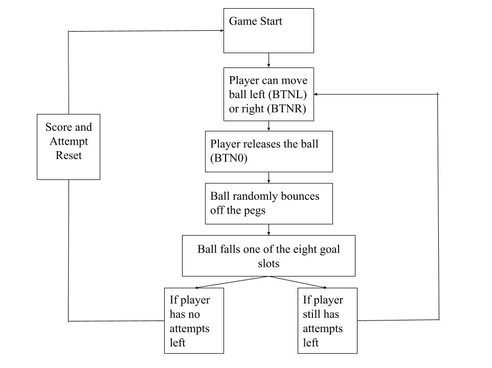

# CPE 487 Final Project: Plinko

## Project Overview
This project implements a **VGA-based Plinko-style arcade game** on the **Digilent Nexys A7 FPGA board** using **VHDL** and **Vivado**. The game features gravity-driven ball motion through a fixed field of pegs and multiple scoring zones at the bottom of the screen. The system generates real-time VGA video, processes user input via onboard pushbuttons, and displays a running score on the onboard 7-segment display.

Here's the game we are basing our project on:


The design follows the modular structure used in the course labs, with separate components for:
- VGA timing and pixel scanning
- Game logic (ball physics, peg collisions, scoring)
- Clock generation
- Seven-segment display control
## Required Hardware
- **Digilent Nexys A7 FPGA Board**


- **VGA Monitor** (800×600 @ 60 Hz)


- **VGA Cable**


- **USB Cable** (programming and power)


--- 

## Scoring System
* Red: 0 points
* Blue: 1 point 
* Green: 2 points 
* Pink: 3 points 
* Gold: 5 points 
--- 
## Gameplay
### GIF
#### Game

#### Board


### JPG


---
## Diagrams
### Module Hierarchy Diagram

### Game Functionality Diagram


---
## Inputs and Outputs
### Inputs
| Signal | Board Resource | Description |
|------|---------------|-------------|
| `clk_in` | 100 MHz clock | System clock |
| `btn0` | Pushbutton | Serve / start | 
| `btnl` | Pushbutton | Move bat left |
| `btnr` | Pushbutton | Move bat right |

### Outputs
| Signal | Board Resource | Description |
|-------|---------------|-------------|
| `VGA_red[3:0]` | VGA DAC | Red channel |
| `VGA_green[3:0]` | VGA DAC | Green channel |
| `VGA_blue[3:0]` | VGA DAC | Blue channel |
| `VGA_hsync` | VGA | Horizontal sync |
| `VGA_vsync` | VGA | Vertical sync |
| `SEG7_anode[7:0]` | 7-seg | Digit select |
| `Counter` | Anode | Score of player |
| `Attempts` | Anode | Attempts of player |


--- 
## Code Files
* 
* 
* 
* 
* 
* 
* 

## Modifications

### `bat_n_ball.vhd` Modified (Plinko Game Logic)

The original `bat_n_ball.vhd` file was based on a basic bat-and-ball pong demo. This file was heavily modified to implement a **Plinko-style game** with pegs, scoring zones, randomness, and limited attempts. Major changes include adding a scoring system, multiple fixed bats at the bottom of the screen, a peg grid for ball deflection, and game state control.

New signals were introduced to track the game state, player score, remaining attempts, and collision locks to prevent double scoring.

```vhdl
...
SIGNAL counter1   : STD_LOGIC_VECTOR(6 DOWNTO 0);
SIGNAL attempts1  : STD_LOGIC_VECTOR(3 DOWNTO 0);
SIGNAL game_on    : STD_LOGIC := '0';
SIGNAL game_over  : STD_LOGIC := '0';
SIGNAL lockpoint  : STD_LOGIC := '0';
...
````

---

## Button-Controlled Ball Position

Before the ball is served, the player can move the ball left and right using the FPGA buttons. The ball’s X-position follows the input value until the serve button is pressed.

```vhdl
ELSIF game_on = '0' THEN
    ball_x_1 <= ball_x;
END IF;
```

This allows the player to aim where the ball will drop, unlike the original demo where the ball always started in a fixed position.

---

## Peg Grid Generation

A staggered grid of pegs was added to simulate a Plinko board. The pegs are generated using nested loops and alternate horizontal offsets every row.

```vhdl
FOR row_idx IN 0 TO max_rows LOOP
    peg_y := row_idx * peg_row_gap + 100;
    FOR col_idx IN 0 TO max_columns LOOP
        IF (row_idx MOD 2 = 0) THEN
            peg_x := col_idx * peg_col_gap + 50;
        ELSE
            peg_x := col_idx * peg_col_gap + 25;
        END IF;
```

Each peg can collide with the ball and change its horizontal direction.

---

## Random Ball Deflection

To make the ball movement unpredictable, a simple linear-feedback shift register (LFSR) random number generator was added. The LFSR produces a pseudo-random bit sequence (for example, 10110100101) that updates every clock cycle. When the ball collides with a peg, the system examines the rightmost bit of the sequence: if the bit is 0, the ball is deflected to the right, and if it is 1, the ball is deflected to the left. After each collision, the sequence shifts so that the rightmost bit moves to the left, allowing a new bit to influence the next deflection. This approach introduces controlled randomness into the ball’s motion.

```vhdl
IF Random_Generator(0) = '0' THEN
    ball_x_motion <= ball_speed;
ELSE
    ball_x_motion <= (NOT ball_speed) + 1;
END IF;

Random_Generator <= Random_Generator(9 DOWNTO 0) &
                    (Random_Generator(10) XOR Random_Generator(9));
```

---

## Multiple Scoring Bats

Instead of a single bat, eight fixed bats were added along the bottom of the screen. Each bat awards a different number of points when hit.

```vhdl
-- Example scoring bat
IF bat7_hit = '1' THEN
    counter1 <= counter1 + 5;
END IF;
```

Some bats award zero points, adding risk and strategy to where the ball lands.

---

## Attempts and Game Over Logic

The game includes a limited number of attempts. Each time the ball reaches the bottom, one attempt is consumed. The attempts decrement from 5,4,3,2, to 1 which allows 5 attempts. When no attempts remain, the game ends. 

```vhdl
IF attempts1 > "0001" THEN
	attempts1 <= attempts1 - 1;
ELSIF attempts1 = "0001" THEN
	attempts1 <= "0000";
	game_over <= '1';
END IF;
```

---

## Collision Locking

Because collision detection runs every clock cycle, a lock signal was added to prevent the same collision from being counted multiple times.

```vhdl
IF lockpoint = '0' THEN
    counter1 <= counter1 + 1;
    lockpoint <= '1';
END IF;
```

### `pong.vhd`
The top level file of our project was based off of `pong.vhd` from Lab 6. We modified the original “batpos” from lab 6 to now be “ball_x_pos.” Instead of the bat moving, the ball can move from side to side. We also added a constraint where the player cannot move the ball passed x less than 20 and x greater than 780. We implemented “btnl-counter” and “btnr-counter” to slow down how fast the ball moves when a button is held. The clock runs fast, so if the ball moved every time the clock ticked, it would fly across the screen instantly. Instead, when the left or right button is held down, the counter starts counting clock cycles, and only when it reaches 1,000,000 does the ball move a little bit. After the ball moves, the counter resets and starts counting again. If the button is released, the counter resets right away. This makes the ball move smoothly and at a speed that can actually be controlled.
```vhdl

   COMPONENT bat_n_ball IS
        PORT (
            v_sync : IN STD_LOGIC;
            pixel_row : IN STD_LOGIC_VECTOR(10 DOWNTO 0);
            pixel_col : IN STD_LOGIC_VECTOR(10 DOWNTO 0);
            serve : IN STD_LOGIC;
            red : OUT STD_LOGIC;
            green : OUT STD_LOGIC;
            blue : OUT STD_LOGIC;
            counter : OUT STD_LOGIC_VECTOR(6 DOWNTO 0);
            attempts : OUT STD_LOGIC_VECTOR(3 DOWNTO 0);
            ball_x : IN STD_LOGIC_VECTOR (10 DOWNTO 0)
        );
    END COMPONENT;
    
    COMPONENT vga_sync IS
        PORT (
            pixel_clk : IN STD_LOGIC;
            red_in    : IN STD_LOGIC_VECTOR (3 DOWNTO 0);
            green_in  : IN STD_LOGIC_VECTOR (3 DOWNTO 0);
            blue_in   : IN STD_LOGIC_VECTOR (3 DOWNTO 0);
            red_out   : OUT STD_LOGIC_VECTOR (3 DOWNTO 0);
            green_out : OUT STD_LOGIC_VECTOR (3 DOWNTO 0);
            blue_out  : OUT STD_LOGIC_VECTOR (3 DOWNTO 0);
            hsync : OUT STD_LOGIC;
            vsync : OUT STD_LOGIC;
            pixel_row : OUT STD_LOGIC_VECTOR (10 DOWNTO 0);
            pixel_col : OUT STD_LOGIC_VECTOR (10 DOWNTO 0)
        );
    END COMPONENT;
    
    COMPONENT clk_wiz_0 is
        PORT (
            clk_in1  : in std_logic;
            clk_out1 : out std_logic
        );
    END COMPONENT;
    
    COMPONENT leddec16 IS
        PORT (
            dig : IN STD_LOGIC_VECTOR (2 DOWNTO 0);
            data : IN STD_LOGIC_VECTOR (19 DOWNTO 0);
            anode : OUT STD_LOGIC_VECTOR (7 DOWNTO 0);
            seg : OUT STD_LOGIC_VECTOR (6 DOWNTO 0)
        );
    END COMPONENT;
    
BEGIN
    button_control : PROCESS (clk_in) is
    BEGIN
        if rising_edge(clk_in) then
            IF btnl = '1' THEN
                btnl_counter <= btnl_counter + 1;
                IF btnl_counter = 1000000 THEN
                    IF ball_x_pos > 20 THEN
                        ball_x_pos <= ball_x_pos - 5;
                    END IF;
                    btnl_counter <= (OTHERS => '0');
                END IF;
            ELSE
                btnl_counter <= (OTHERS => '0');
            END IF;
            
            IF btnr = '1' THEN
                btnr_counter <= btnr_counter + 1;
                IF btnr_counter = 1000000 THEN
                    IF ball_x_pos < 780 THEN
                        ball_x_pos <= ball_x_pos + 5;
                    END IF;
                    btnr_counter <= (OTHERS => '0');
                END IF;
            ELSE
                btnr_counter <= (OTHERS => '0');
            END IF;
        end if;
    END PROCESS;
    
    counter_display : PROCESS (clk_in)
    BEGIN
        if rising_edge(clk_in) then
            count <= count + 1;
        end if;
    END PROCESS;
    
    led_mpx <= count(19 DOWNTO 17);
    
    add_bb : bat_n_ball
    PORT MAP(
        v_sync => S_vsync, 
        pixel_row => S_pixel_row, 
        pixel_col => S_pixel_col, 
        serve => btn0, 
        red => S_red, 
        green => S_green, 
        blue => S_blue,
        counter => display(6 DOWNTO 0),
        attempts => attempts_sig,
        ball_x => ball_x_pos
    );
```

### `leddec16.vhd`
This file was modified so there are more bits in data. Since we needed 4 anodes for the score and 1 anode for the amount of attempts the player has. We also had to turn on the 5th anode to display the attempts.
```vhdl
ENTITY leddec16 IS
	PORT (
		dig : IN STD_LOGIC_VECTOR (2 DOWNTO 0); -- which digit to currently display
		data : IN STD_LOGIC_VECTOR (19 DOWNTO 0); -- 20-bit (5-digit) data
		anode : OUT STD_LOGIC_VECTOR (7 DOWNTO 0); -- which anode to turn on
		seg : OUT STD_LOGIC_VECTOR (6 DOWNTO 0)); -- segment code for current digit
END leddec16;

ARCHITECTURE Behavioral OF leddec16 IS
	SIGNAL data4 : STD_LOGIC_VECTOR (3 DOWNTO 0); -- binary value of current digit
BEGIN
	-- Select digit data to be displayed in this mpx period
	data4 <= data(3 DOWNTO 0) WHEN dig = "000" ELSE -- digit 0
	         data(7 DOWNTO 4) WHEN dig = "001" ELSE -- digit 1
	         data(11 DOWNTO 8) WHEN dig = "010" ELSE -- digit 2
	         data(15 DOWNTO 12) WHEN dig = "011" ELSE -- digit 3
	         data(19 DOWNTO 16); -- digit 4

...

	anode <= "11111110" WHEN dig = "000" ELSE -- 0
	         "11111101" WHEN dig = "001" ELSE -- 1
	         "11111011" WHEN dig = "010" ELSE -- 2
	         "11110111" WHEN dig = "011" ELSE -- 3
	         "11101111" WHEN dig = "100" ELSE -- 4
	         "11111111";
```


--- 
## Project Setup Instructions
1. Download all VHDL and .xdc files from this repo
2. Create a new Vivado project for the Nexys A7-100T
3. Add Sources: clk_wiz_0.vhd, clk_wiz_0_clk_wiz.vhd, vga_sync.vhd, bat_n_ball.vhd, leddec16.vhd, and pong.vhd
4. Add Constraints File: pong.xdc
5. Run Synthesis
6. Run Implementation
7. Generate Bitstream
8. Open Hardware Manager and Program the Device

--- 
## Conclusion
### Summary
* Our group had the opportunity to create a Plinko game in Vivado, coded using Very High Speed Integrated Circuit Hardware Description Language (VHDL).
* We explored the process of game development while strengthening our VHDL skills.
* Overall, it was a fascinating experience, as we learned how to apply the concepts from Pong to create a Plinko game.

### Timeline
11/14/2025 
* Began brainstorming ideas for the project

11/18/2025
* Submitted our project idea as Plinko

11/20/2025
* Began work on the Plinko project by modifying the Pong lab
* Reworked the bat functionality so 8 appeared on the bottom
		   
11/25/2025 
* Added pegs that were spread out across the screen.
* Reworked the ball so that it would be dropped from the top instead of coming from the bottom

12/2/2025
* Recolored the bats to be different colors

12/4/2025
* Added the ability to record the score of the game

12/14/2025
* Added collision to the pegs
* Made the ball visible before it was dropped
* Recolored the bats and assigned proper point values
		   
12/15/2025
* Added a counter to show the number of attempts left
* Finalized the poster

### Difficulties
The greatest difficulty our team encountered was creating collisions between the pegs and the ball. We mainly had issues with detecting the overlap of the ball and the pegs. We fixed this by adjusting the detection dimensions of the peg to allow for better overlap with the ball. Another issue we had was with the random bounce that the ball would have when it collided with a peg. We fixed this by implementing a signal that has a fixed value that would determine which way the ball bounced. Since it would reset with every clock cycle, this demonstrated the random effect taking place of whether it went to the right or left.

### Responsibility
As a group, we all contributed to the GitHub Repository. 
Below is what we each contributed:

John Carlo Figueras:
* I worked on drawing the pegs in the bat_n_ball.vhd.
* I worked on displaying and accumulating the scores as the counter values on the board in the bat_n_ball.vhd and leddec.vhd.

Connor Hsuan:
* I worked on the collision of the ball with all the pegs in the bat_n_ball.vhd from Eli's advice.
* I worked on the attempts display on the board in the bat_n_ball.vhd and leddec.vhd.

Deep Shah:
* I worked on drawing the bats in the bat_n_ball.vhd.
* I worked on colliding the ball with all the bats in the bat_n_ball.vhd.
* I use my computer to run all the code for our group.

---
## Future Works
If we wanted to continue working on our project in the future, we plan to implement:
* Implementing a betting system in the current Plinko game where the user starts with a set amount of money, which is displayed on the anodes. The user can place a bet, and if the ball hits a bat, their money could increase or decrease. This adds excitement and introduces a risk element to the game.
* After the ball hits a bat, the bats will randomly change their locations.


