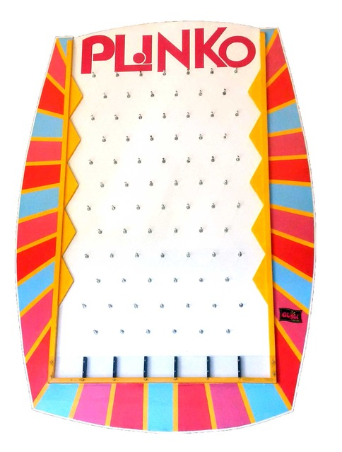
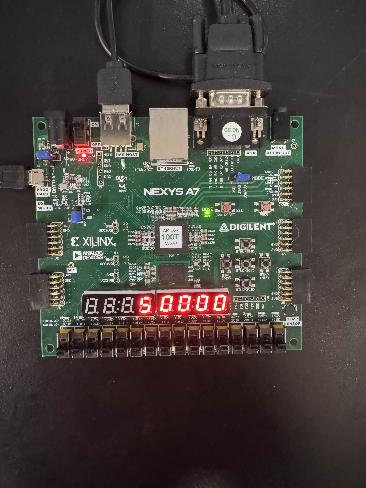

# FPGA VGA Plinko Game (Nexys Board)

## Project Overview
This project implements a **VGA-based Plinko-style arcade game** on the **Digilent Nexys A7 FPGA board** using **VHDL** and **Vivado**. The game features gravity-driven ball motion through a fixed field of pegs and multiple scoring zones at the bottom of the screen. The system generates real-time VGA video, processes user input via onboard pushbuttons, and displays a running score on the onboard 7-segment display.

Here's the game we are basing our project on:

The design follows the modular structure used in the course labs, with separate components for:
- VGA timing and pixel scanning
- Game logic (ball physics, peg collisions, scoring)
- Clock generation
- Seven-segment display control
## Required Hardware
- **Digilent Nexys FPGA board**

- **VGA monitor** (800×600 @ 60 Hz)

- **VGA cable**

- **USB cable** (programming and power)

--- 
## Diagrams
Some kind of high level block diagram showing how different parts of your program connect together and/or showing how what you have created might fit into a more complete system could be appropriate instead

## Add gif/vid/pics of gameplay

---

## Inputs and Outputs
### Inputs
| Signal | Board Resource | Description |
|------|---------------|-------------|
| `clk_in` | 100 MHz clock | System clock |
| `btn0` | Pushbutton | Serve / start | 
| `btnl` | Pushbutton | Move bat left |
| `btnr` | Pushbutton | Move bat right |

### Outputs
| Signal | Board Resource | Description |
|-------|---------------|-------------|
| `VGA_red[3:0]` | VGA DAC | Red channel |
| `VGA_green[3:0]` | VGA DAC | Green channel |
| `VGA_blue[3:0]` | VGA DAC | Blue channel |
| `VGA_hsync` | VGA | Horizontal sync |
| `VGA_vsync` | VGA | Vertical sync |
| `SEG7_anode[7:0]` | 7-seg | Digit select |
| `Counter` | 7-seg | Segment data |
| `SEG7_seg[6:0]` | 7-seg | Segment data |
| `SEG7_seg[6:0]` | 7-seg | Segment data |

--- 
## Modifications
talk about how we used lab 6

--- 
## Project Setup Instructions
1. Download all VHDL and .xdc files from this repo
2. Create a new Vivado project for the Nexys A7-100T
3. Add Sources:
.vhd
.vhd
4. Add Constraints File: .xdc
5. Run Synthesis
6. Run Implementation
7. Generate Bitstream
8. Open Hardware Manager and Program the Device

--- 
## Conclusion
In conclusion, our group has the wonderful opportunity We created the game Plinko by coding VHDL  in Vivado.
We got the opportunity to create a game and strengthen our skills in VHDL.

## Future Works
Future works include creating the Plinko with a betting system and implementing changes in location of the bats after hitting it.

